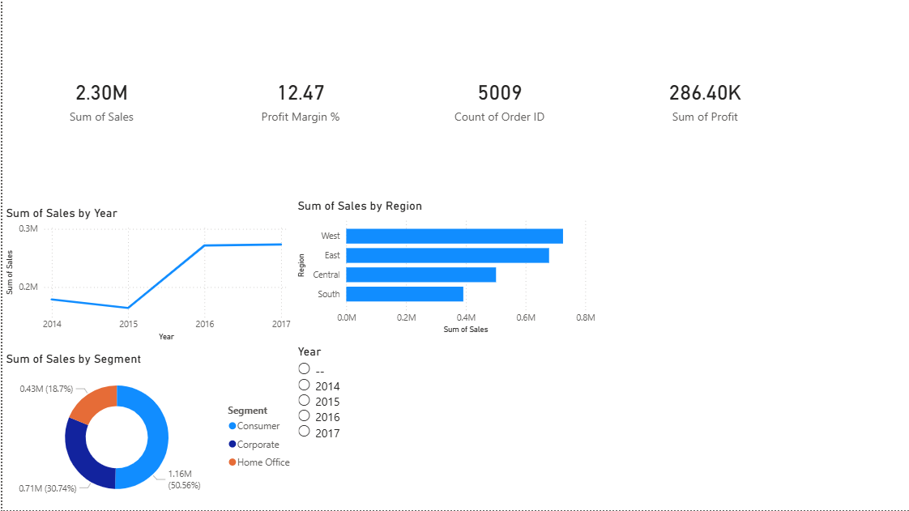

# SQL Sales Dashboard

End-to-end data analysis project on 9,994 Superstore sales records.
15 SQL queries covering aggregations, CTEs, window functions and
business KPIs — visualised in a 3-page Power BI dashboard.

## Key insights uncovered
- West region generates highest revenue ($725K) but Central has 
  the lowest profit margin at 7.92%
- Orders with over 40% discount generate negative average profit —
  heavily discounted orders are loss-making
- Canon imageCLASS Copier is the #1 product at $61K revenue
- Loyal customers (6+ orders) spend 8x more than one-time buyers
- California and New York drive the highest regional profits

## Dashboard pages
| Page | Focus |
|------|-------|
| Executive Summary | KPIs, yearly trend, region breakdown, segment split |
| Product Analysis | Category treemap, scatter plot, top 10 products |
| Customer & Geography | US map, top customers, region slicer |

## SQL concepts demonstrated
- Aggregations, GROUP BY, HAVING
- CTEs — multi-step RFM customer segmentation
- Window functions — RANK(), LAG(), moving averages, running totals
- Date functions — YoY and MoM growth calculations
- Subqueries and CASE WHEN discount impact analysis

## Dashboard preview

## Tech stack
SQLite · Python (Pandas) · Power BI Desktop · DAX

## How to run
1. Clone the repo
2. Run `pip install pandas` 
3. Run `python load_data.py` to create the database
4. Open `sql/queries.sql` in DBeaver or any SQL editor
5. Open `dashboard/sales_dashboard.pbix` in Power BI Desktop