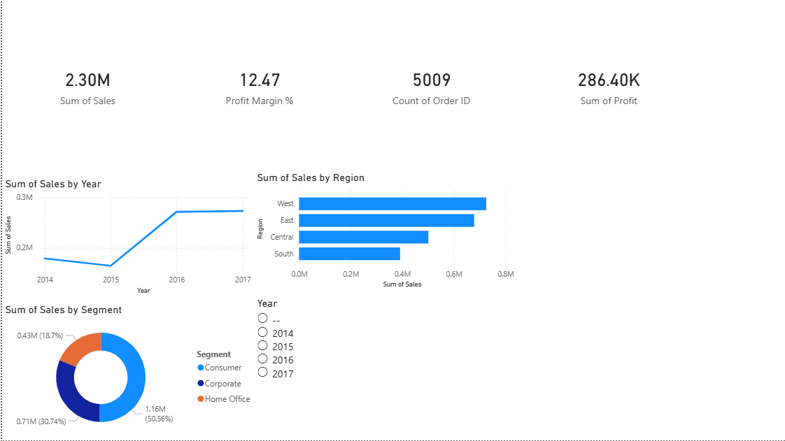

# SQL Sales Dashboard
An end-to-end Business Intelligence project that analyzes retail sales data using SQL and Power BI. The project focuses on transforming raw sales data into actionable business insights by identifying sales trends, customer purchasing behavior, product performance, and profitability.

The dashboard enables business stakeholders to monitor key performance indicators (KPIs), identify opportunities for growth, and make informed, data-driven decisions.

## Business Problem
Retail businesses generate large volumes of transactional data every day. Without proper analysis, it becomes difficult to identify profitable products, loyal customers, regional performance, and factors affecting profitability.
This project aims to answer key business questions using SQL analysis and interactive Power BI dashboards to support strategic business decisions.

Analyze overall sales performance.
Identify top-performing products.
Analyze customer purchasing behavior.
Measure regional performance.
Evaluate profitability.
Build an executive dashboard.

## Dataset
Superstore Dataset
Records: 9,994
Sales
Profit
Discount
Category
Sub-category
Region
Customer
Order Date

## Tools Used
SQL
SQLite
Python
Power BI
DAX

## Key insights uncovered
✔ Customers with high purchase frequency generated significantly more revenue.

✔ Discounts above 40% often reduced profitability.

✔ Technology products generated the highest revenue.

✔ Sales varied considerably across different states.

✔ Customer segmentation highlighted valuable repeat customers.

## Dashboard pages
| Page | Focus |
|------|-------|
| Executive Summary | KPIs, yearly trend, region breakdown, segment split |
| Product Analysis | Category treemap, scatter plot, top 10 products |
| Customer & Geography | US map, top customers, region slicer |

## SQL concepts demonstrated
- Aggregations, GROUP BY, HAVING
- CTEs — multi-step RFM customer segmentation
- Window functions — RANK(), LAG(), moving averages, running totals
- Date functions — YoY and MoM growth calculations
- Subqueries and CASE WHEN discount impact analysis

## Dashboard preview

## Tech stack
SQLite · Python (Pandas) · Power BI Desktop · DAX

## How to run
1. Clone the repo
2. Run `pip install pandas` 
3. Run `python load_data.py` to create the database
4. Open `sql/queries.sql` in DBeaver or any SQL editor
5. Open `dashboard/sales_dashboard.pbix` in Power BI Desktop
